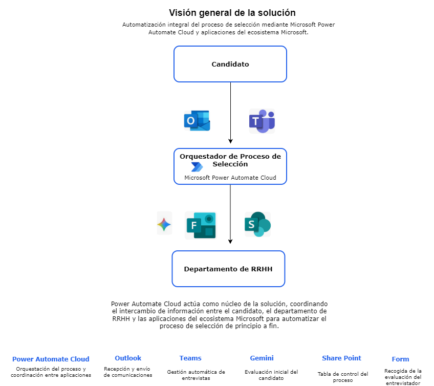

# Orquestador de Entrevistas de Selección
Automatización integral del proceso de selección desde la recepción del currículum , la concertación de entrevista hasta la evaluación final del candidato mediante Microsoft Power Automate Cloud y las aplicaciones del ecosistema Microsoft.

Esta solución fue desarrollada como proyecto colaborativo durante mi formación en automatización de procesos. Realizado a través de una metodología colaborativa (Mob Programing), en la que todo el equipo participó en el análisis, diseño, desarrollo y validación de esta solución.

Mi contribución

Durante el proyecto mis principales responsabilidades se centraron en:

* Propuesta y análisis de ideas orientadas a resolver necesidades reales de negocio.
* Evaluación y selección de la solución final desarrollada.
* Desarrollo del Módulo 4 y participación en el Módulo 5.
* Revisión funcional del documento PDD elaborado por el equipo.
* Preparación y participación en exposición grupal de la presentación final del proyecto ante el tribunal.

Esta experiencia me ha permitido consolidar los conocimientos en las técnologías utilizadas , pero sobre todo , detectar las necesidades reales y comprender cómo las automatizaciones pueden ayudar a optimizar procesos, contribuir a mejorar la productividad y la eficiencia de las empresas, así como, permitir que los empleados dediquen más tiempo a actividades de mayor valor.

El reto

Los departamentos de Recursos Humamos gestionan diariamente una cantidad considerables de candidaturas que necesitan una revisión manual, además de coordinación entre distintas herramientas y un seguimiento constante durante todo el proceso de selección.

Estas tareas, además de consumir una parte importante del tiempo por parte de personal, incrementan el riesgo de cometer errores, retrasos y falta de trazabilidad.

El objetivo de esta solución fue diseñar una automatización que permitiese reducir la carga de trabajo administrativo, mejorar el seguimiento de las candidaturas y facilitar la toma de decisiones, permitiendo al personal de Recursos Humanos a invertir más tiempo y esfuerzo en el contacto con las personas y menos en las tareas repetitivas.

La solución propuesta

Con el fin de dar respuesta a este reto, se diseñó una solución de automatización basada en Microsoft Power Automate Cloud, capaz de coordinar de manera automática las distintas fases del proceso de selección de candidatos.

Dicha solución aprovecha la integración de diferentes aplicaciones del ecosistema Microsoft para centralizar la información, automatizar las tareas repetitivas y garantizar la trazabilidad de cada candidatura durante todo el proceso.

Con el fin de facilitar el mantenimiento y escalabilidad, la solución se estructuró en módulos independientes que trabajan de forma coordinada. Cada módulo responde a un evento o cambio de estado específico, permitiendo ejecutar únicamente las acciones necesarias en cada fase del proceso.

Este enfoque modular permite construir procesos más organizados, facilitar futuras ampliaciones, así como adaptar dicha solución a las necesidades de diferentes organizaciones sin modificar el resto de componentes necesariamente.

## Visión general de la solución

