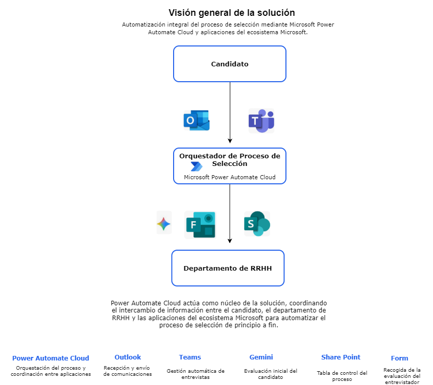
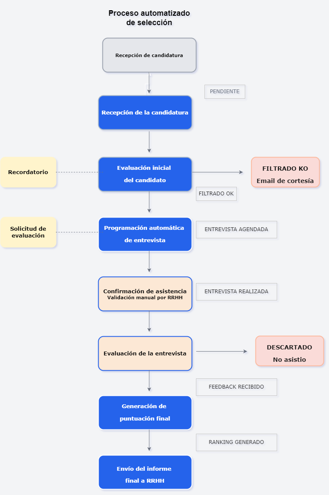

# Orquestador de Entrevistas de Selección
Automatización integral del proceso de selección desde la recepción del currículum, la concertación de entrevista hasta la evaluación final del candidato mediante Microsoft Power Automate Cloud y las aplicaciones del ecosistema Microsoft.

Esta solución fue desarrollada como proyecto colaborativo durante mi formación en automatización de procesos. Realizado a través de una metodología colaborativa (Mob Programing), en la que todo el equipo participó en el análisis, diseño, desarrollo y validación de esta solución.

Mi contribución

Durante el proyecto mis principales responsabilidades se centraron en:

* Propuesta y análisis de ideas orientadas a resolver necesidades reales de negocio.
* Evaluación y selección de la solución final desarrollada.
* Desarrollo del Módulo 4 y participación en el Módulo 5.
* Revisión funcional del documento PDD elaborado por el equipo.
* Preparación y participación en exposición grupal de la presentación final del proyecto ante el tribunal.

Esta experiencia me ha permitido consolidar los conocimientos en las tecnologías utilizadas , pero sobre todo , detectar las necesidades reales y comprender cómo las automatizaciones pueden ayudar a optimizar procesos, contribuir a mejorar la productividad y la eficiencia de las empresas, así como, permitir que los empleados dediquen más tiempo a actividades de mayor valor.

El reto

Los departamentos de Recursos Humanos gestionan diariamente una cantidad considerable de candidaturas que necesitan una revisión manual, además de coordinación entre distintas herramientas y un seguimiento constante durante todo el proceso de selección.

Estas tareas, además de consumir una parte importante del tiempo del personal, incrementan el riesgo de cometer errores, retrasos y falta de trazabilidad.

El objetivo de esta solución fue diseñar una automatización que permitiese reducir la carga de trabajo administrativo, mejorar el seguimiento de las candidaturas y facilitar la toma de decisiones, permitiendo al personal de Recursos Humanos invertir más tiempo y esfuerzo en el contacto con las personas y menos en las tareas repetitivas.

La solución propuesta

Con el fin de dar respuesta a este reto, se diseñó una solución de automatización basada en Microsoft Power Automate Cloud, capaz de coordinar de manera automática las distintas fases del proceso de selección de candidatos.

Dicha solución aprovecha la integración de diferentes aplicaciones del ecosistema Microsoft para centralizar la información, automatizar las tareas repetitivas y garantizar la trazabilidad de cada candidatura durante todo el proceso.

Con el fin de facilitar el mantenimiento y la escalabilidad, la solución se estructuró en módulos independientes que trabajan de forma coordinada. Cada módulo responde a un evento o cambio de estado específico, permitiendo ejecutar únicamente las acciones necesarias en cada fase del proceso.

Este enfoque modular permite construir procesos más organizados, facilitar futuras ampliaciones, así como adaptar dicha solución a las necesidades de diferentes organizaciones sin modificar el resto de componentes.

## Visión general de la solución

Esta automatización coordina la interacción entre el candidato y el departamento de RRHH a través de las aplicaciones del ecosistema de Microsoft mediante un flujo automatizado que gestiona el proceso de selección.

## Flujo funcional del proceso

El siguiente flujo muestra las etapas principales del proceso automatizado de selección, desde la recepción de la candidatura hasta el envío del informe final al departamento de RRHH. La solución propuesta combina tareas automatizadas, intervenciones manuales y procesos recurrentes para agilizar la gestión de las candidaturas y facilitar la toma de decisiones.

## Tecnologías utilizadas

La solución se desarrolló mediante el entorno de Microsoft Power Automate Cloud, aprovechando la integración con diferentes aplicaciones del ecosistema Microsoft para coordinar las diferentes etapas del proceso.

### Microsoft Power Automate Cloud

Actúa como elemento principal de la solución, permitiendo coordinar los diferentes flujos, automatizar tareas y reaccionar ante eventos y cambios de estado durante el proceso de selección.

### Aplicaciones del ecosistema Microsoft

La solución integra diferentes aplicaciones para gestionar la información y facilitar la comunicación entre los participantes del proceso:

- **Microsoft Forms:** recopilación de información y evaluaciones.
- **Microsoft SharePoint:** almacenamiento y seguimiento de la información de las candidaturas.
- **Microsoft Outlook:** gestión de las comunicaciones por correo electrónico.
- **Microsoft Teams:** coordinación y realización de las entrevistas.

### Integración con IA
Se incorporó una integración mediante petición HTTP a un servicio de IA para apoyar la evaluación inicial de los candidatos a partir de la información disponible en su currículum y la oferta publicada.

## Retos y aprendizajes

La programación automática de las entrevistas supuso uno de los retos más importantes, ya que era necesario tener en cuenta la disponibilidad del entrevistador y coordinar la comunicación con las diferentes personas implicadas en el proceso de selección.

Durante el desarrollo también comprendimos la importancia de estructurar correctamente un proceso antes de automatizarlo. Definir los estados, las condiciones y las responsabilidades de cada etapa, permitió construir una solución más organizada, eficiente y optimizada.

Además, el proyecto nos permitió identificar aspectos que deben tenerse en cuenta en una solución real, como la necesidad de mantener determinados puntos de intervención humana y las consideraciones relacionadas con la protección de datos en los procesos de selección.

A nivel personal, esta experiencia me ayudó a entender la importancia del análisis de procesos y mi interés por buscar soluciones que aporten un valor real a las empresas. Aprendí que automatizar no consiste solamente en  ejecutar tareas de forma automática, sino en comprender primero el proceso, detectar dónde existe una oportunidad de mejora y de cómo puede la automatización ayudar a hacerlo más eficiente.   

## Posibles mejoras

Como evolución de la solución y pensando en su adaptación a un entorno empresarial real, se identificaron diferentes líneas de mejora orientadas a aumentar su seguridad, escalabilidad, flexibilidad y capacidad de adaptación a las necesidades de cada organización.

Entre las principales mejoras se plantean las siguientes:

- **Mejorar el control de candidaturas duplicadas**, evitando que una misma persona pueda generar registros repetidos para una misma oferta y facilitando una gestión más eficiente de la información.

- **Reforzar la seguridad de la solución**, especialmente en la gestión de credenciales, información de los candidatos y comunicaciones con servicios externos.

- **Ampliar las validaciones de los documentos recibidos**, mejorando la gestión de diferentes formatos de currículum y aumentando la seguridad de los archivos antes de su procesamiento.

- **Incorporar controles adicionales en el uso de IA**, con el objetivo de mejorar la fiabilidad de los resultados y reducir posibles riesgos derivados del contenido de los documentos analizados.

- **Adaptar la solución a diferentes organizaciones y entornos**, permitiendo configurar aspectos como zonas horarias, criterios del proceso y necesidades específicas de cada empresa.

Estas mejoras permitirían evolucionar la solución desde un proyecto formativo hacia una automatización más flexible, segura y preparada para adaptarse a diferentes escenarios empresariales.
